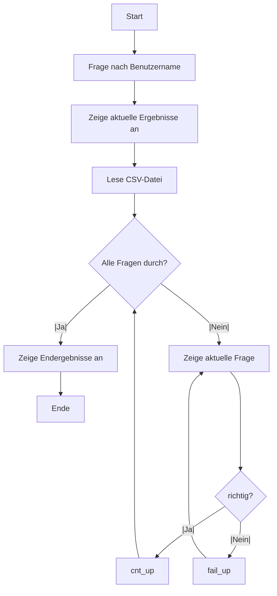

```mermaid
flowchart TD
    A[Start] --> B[Frage nach Benutzername]
    B --> D[Zeige aktuelle Ergebnisse an]
    D --> E[Lese CSV-Datei]
    E --> F{Alle Fragen durch?}
    F --|Ja|--> G[Zeige Endergebnisse an]
    F --|Nein|--> H[Zeige aktuelle Frage]

    H ----> L{richtig?}
    L --|Ja|--> M[cnt_up]
    M --> F
   
    L --|Nein|--> O[fail_up]
    O --> H

    G --> P[Ende]
```
