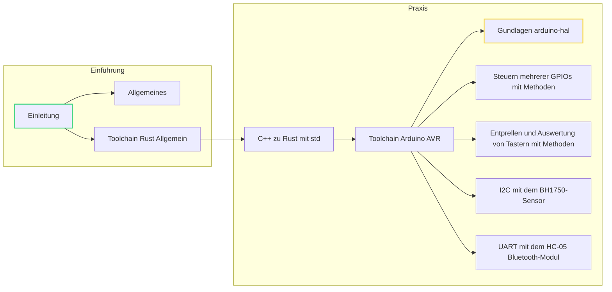

```mermaid
graph LR
    subgraph Einführung [Einführung]
        direction TB
        A[Einleitung] --> B1[Allgemeines]
        A[Einleitung] --> B2[Toolchain Rust Allgemein]
    end

    subgraph Praxis [Praxis]
        direction TB
        B2 --> B3[C++ zu Rust mit std]
        B3 --> H[Toolchain Arduino AVR]
    
        H --> D[Gundlagen arduino-hal]
        H --> E[Steuern mehrerer GPIOs mit Methoden]
        H --> F[Entprellen und Auswertung von Tastern mit Methoden]
        H --> G[I2C mit dem BH1750-Sensor]
        H --> I[UART mit dem HC-05 Bluetooth-Modul]
    end

    %% Styling für die verschiedenen Flows
    class A,C flow1;
    class D flow2

    %% Definition der Klassen
    classDef flow1 stroke:#33d17a,stroke-width:2px;
    classDef flow2 stroke:#f9d94b,stroke-width:2px;

```
